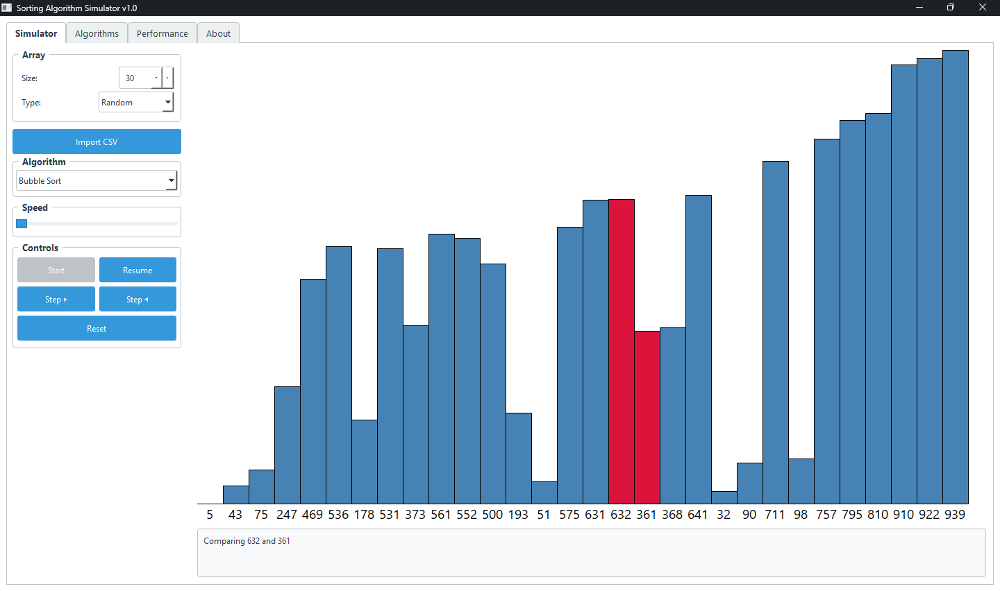
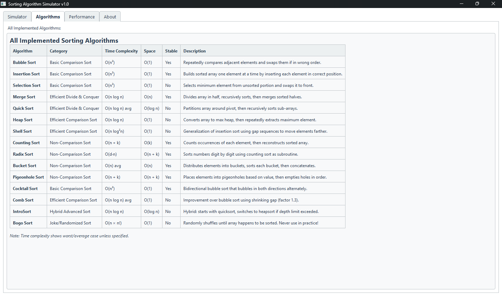

# Sorting Algorithms Simulator


An educational desktop application to visualize and compare 15+ sorting algorithms with interactive step-by-step execution, performance metrics, and detailed explanations.

## 🚀 Features

- **15+ Sorting Algorithms**: Basic, Efficient, Non-Comparison, and Hybrid algorithms
- **Interactive Visualization**: Step-by-step execution with color-coded bars
- **Performance Metrics**: Real-time comparisons, swaps, and execution time
- **Multiple Input Options**: Random, sorted, custom arrays, and CSV import
- **Educational Content**: Detailed explanations for all algorithms
- **Cross-Platform**: Windows, macOS, and Linux support

## 📺 Screenshots




## 🛠️ Installation

### From Source
1. Clone the repository:
   ```bash
   git clone https://github.com/attilaasghari/Sorting-Algorithms-Simulator.git
   cd Sorting-Algorithms-Simulator
   ```
2. Install dependencies:
    ```bash
    pip install -r requirements.txt
    ```
3. Run the application:
    ```bash
    python main.py
    ```
### Pre-compiled Executables
Download the latest release for your operating system from the [Releases](https://github.com/attilaasghari/Sorting-Algorithms-Simulator/releases?spm=a2ty_o01.29997173.0.0.762fc921A5g7N1) page.

## 📚 Supported Algorithms
### Basic Comparison Sorts
- Bubble Sort
- Insertion Sort
- Selection Sort
- Cocktail Sort (Bidirectional Bubble)
- Comb Sort
### Efficient Divide & Conquer
- Merge Sort
- Quick Sort
- Heap Sort
- Shell Sort
- IntroSort (Hybrid)
### Non-Comparison Sorts
- Counting Sort
- Radix Sort
- Bucket Sort
- Pigeonhole Sort
### Educational/Novelty
- Bogo Sort (Stupid Sort)

## 🎯 Requirements
- Python 3.8+
- PyQt6
- NumPy

## 📦 Building Executables
To create standalone executables:
```bash
# Install build dependencies
pip install pyinstaller

# Build executable
python build.py
```
## 📄 License
This project is licensed under the MIT License - see the [LICENSE](LICENSE) file for details.

## 🙏 Acknowledgments
- PyQt6 for the GUI framework
- NumPy for array operations


