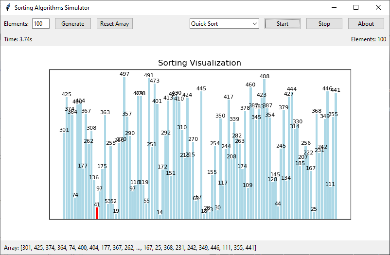
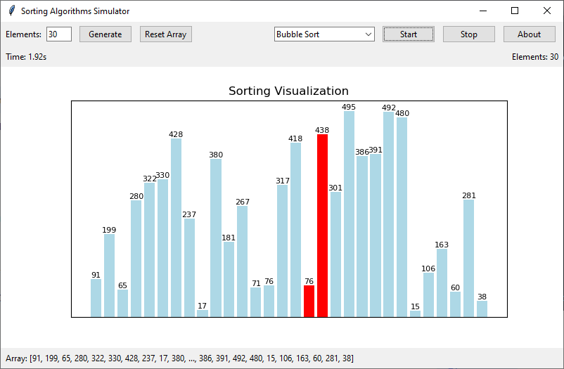
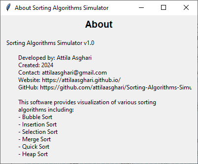

# Sorting Algorithms Simulator 🎯

[](https://opensource.org/licenses/MIT)
[](https://www.python.org/)

A interactive visualization tool for sorting algorithms implemented with Python GUI

 

## 🌟 Features

- **6 Sorting Algorithms**:
  - Bubble Sort
  - Insertion Sort
  - Selection Sort
  - Merge Sort
  - Quick Sort
  - Heap Sort
  
- **Interactive Visualization**:
  - Real-time sorting progress visualization
  - Color-coded element comparison
  - Value labels on bars
  - Array size customization (3-500 elements)
  
- **Performance Tracking**:
  - Real-time timer
  - Operation counter
  - Algorithm comparison capability
  
- **User-Friendly Controls**:
  - Start/Stop/Restart functionality
  - Reset to original unsorted state
  - Dynamic array display
  - About section with developer info

## 🚀 Getting Started

### Prerequisites
- Python 3.x
- Tkinter (usually included with Python)
- Matplotlib

### Installation
1. Clone the repository:
```bash
git clone https://github.com/attilaasghari/Sorting-Algorithms-Simulator.git
cd sorting-algorithms-simulator
```
2. Install required packages:

```bash
pip install matplotlib
```

## Usage 
Run the simulator
```bash
python main.py
```

**Basic Workflow**:
1. Enter desired array size (3-500)
2. Click "Generate" to create new random array
3. Select algorithm from dropdown
4. Click "Start" to begin visualization
5. Use "Stop" to pause/reset
6. Try different algorithms on same dataset using "Reset Array"

## 📸 Screenshots

| Main Interface | About Window |
|----------------|--------------|
|  |  |

## 🛠️ Development

### Project Structure
```
.
├── main.py    # Main application code
├── README.md               # Project documentation
└── assets/            # Application screenshots
```

### Contributing
Contributions are welcome! Here's how:
1. Fork the project
2. Create your feature branch (`git checkout -b feature/AmazingFeature`)
3. Commit your changes (`git commit -m 'Add some AmazingFeature'`)
4. Push to the branch (`git push origin feature/AmazingFeature`)
5. Open a Pull Request

Suggested improvements:
- Add more sorting algorithms
- Implement speed control slider
- Add sound effects for swaps
- Create comparison mode

## 📜 License
Distributed under the MIT License. See `LICENSE` for more information.

## 📧 Contact
Attila Asghari - [@attila_asghari](https://www.instagram.com/attila_asghari/) - attilaasghari@gmail.com

Project Link: [https://github.com/attilaasghari/Sorting-Algorithms-Simulator](https://github.com/attilaasghari/Sorting-Algorithms-Simulator)

---
